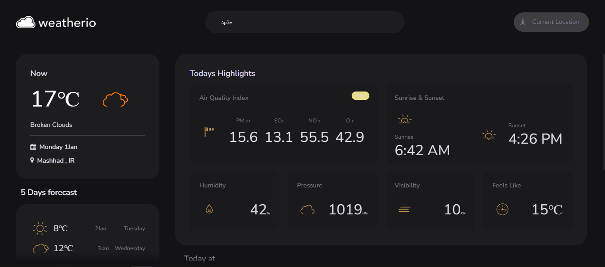
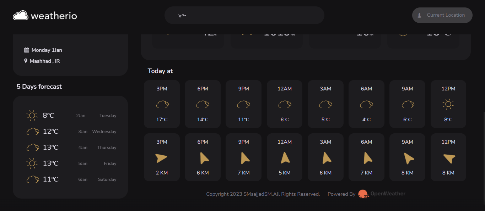

# Weather App
## What do you think the weather is like today?!!


[Demo of Todolist](https://smsajjadsm.github.io/Weather-Web-SMsajjadSM/)
===




## Features

- Get updated data using api
- Displaying various information such as speed and pollution and..... weather
- The ability to receive your location and display weather forecast
- Responsive


## Installation


First clone project ...

```sh
https://github.com/SMsajjadSM/Weather-Web-SMsajjadSM.git
```

Install the dependencies and devDependencies

```sh
npm i
```


#### How to support?
 If you enjoyed and used this post,
I would appreciate it if you could
support me by giving me a ⭐

[SMsajjadSM](https://github.com/SMsajjadSM/Weather-Web-SMsajjadSM)
